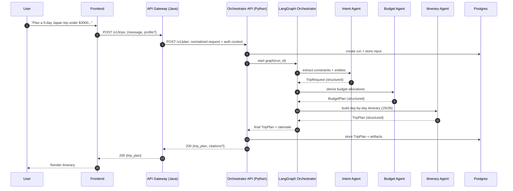
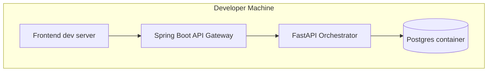

# Phase 1 Architecture (Foundation)

Phase 1 goal: ship an end-to-end “conversational itinerary generator” with a **Java API gateway** in front of a **Python AI Orchestrator**, backed by **Postgres** for persistence. No real external travel APIs yet; use mocked datasets and stubs to keep the system design honest while you build the platform.

## System Context (C4-ish)

```mermaid
flowchart TB
  user([User])
  web[Frontend UI\n(web app or simple client)]

  user --> web

  subgraph platform[AI Travel Planner Platform]
    apigw[API Gateway\nSpring Boot (Java)]
    orchestrator[AI Orchestrator API\nFastAPI (Python)]
    store[(PostgreSQL)]
    vector[(Vector Store - later)]
    cache[(Redis - later)]
  end

  subgraph externals[External Services (later)]
    maps[Maps / Places API]
    flights[Flight Search API]
    hotels[Hotel Search API]
    weather[Weather API]
    currency[Currency FX API]
  end

  web -->|HTTPS| apigw -->|REST/JSON| orchestrator
  orchestrator --> store

  orchestrator -.-> vector
  orchestrator -.-> cache

  orchestrator -.-> maps
  orchestrator -.-> flights
  orchestrator -.-> hotels
  orchestrator -.-> weather
  orchestrator -.-> currency
```

## Phase 1 Services & Responsibilities

```mermaid
flowchart LR
  subgraph java[Java Layer]
    apigw[API Gateway\nSpring Boot]
  end

  subgraph python[Python Layer]
    api[Orchestrator API\nFastAPI]
    graph[Agent Orchestrator\n(LangGraph)]
    agents[Agents\n(Intent, Itinerary, Budget)\n(Phase 1)]
    tools[Tool Registry\n(stubs)]
  end

  subgraph data[Data Layer]
    pg[(Postgres)]
    mock[(Mock travel datasets\nJSON)]
  end

  apigw --> api
  api --> graph --> agents
  agents --> tools --> mock
  api --> pg
```

## Primary Request Flow (Sequence)



## Data Contracts (Phase 1)

Design principle: the platform’s “truth” is **structured JSON**, not prose. Prose is a view.

### `TripRequest` (normalized user intent)
- trip duration (days), dates window, origin, destinations
- budget (total + currency), party size
- preferences (food/culture/nature/nightlife), pace, mobility constraints
- constraints (must-see, avoid, visa/passport notes, kid-friendly)

### `TripPlan` (renderable itinerary)
- lodging base per segment (city + nights)
- per-day plan: morning/afternoon/evening + travel time estimates
- budget bands by day/category (lodging/food/transit/activities)
- alternates + “if raining” options
- assumptions + open questions (to ask user)

### `RunArtifacts`
Store what you need to debug and evaluate:
- input message(s), extracted `TripRequest`, generated `TripPlan`
- model config snapshot (model name, temperature)
- tool calls (stubbed in Phase 1)

## Deployment Topology (local dev → single-host)



## What’s explicitly out of scope for Phase 1
- Real flight/hotel booking and payment flows
- Kafka/event-driven refreshes
- Production RAG ingestion pipelines
- Multi-tenant scaling and autoscaling

Those come after you have the core contracts, orchestration, and observability in place.

