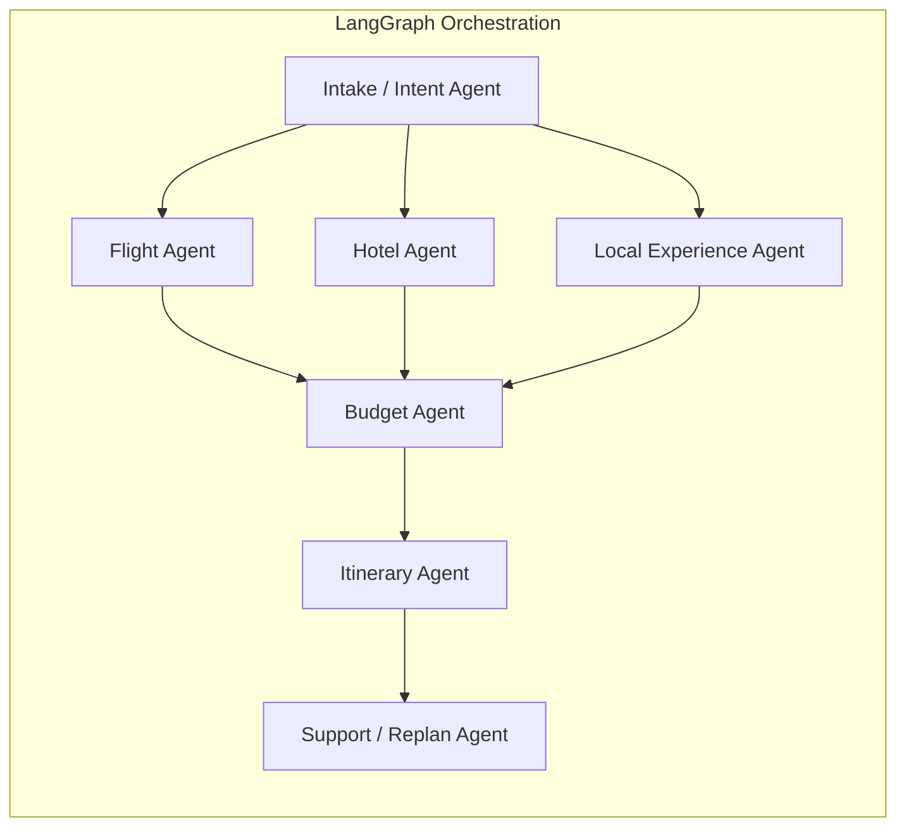

# Target-State Architecture (Post-Phase 1)

This is the “flagship” architecture you evolve toward after the foundation is stable.

## High-level (services + eventing)

```mermaid
flowchart TB
  FE[Frontend UI]
  GW[API Gateway\nSpring Boot (Java)]
  TS[Travel Service\nSpring Boot (Java)]
  BS[Booking Service\nSpring Boot (Java)]
  ES[Event Service\nSpring Boot (Java)]
  AI[AI Engine\nFastAPI + LangGraph (Python)]

  PG[(Postgres)]
  REDIS[(Redis)]
  VEC[(Vector DB)]
  K[(Kafka)]

  FE --> GW
  GW --> TS
  GW --> BS
  GW --> AI

  TS --> PG
  BS --> PG
  AI --> PG
  AI --> VEC
  TS --> REDIS

  TS --> K
  BS --> K
  AI --> K
  ES --> K

  subgraph External_APIs[External APIs via MCP Tools]
    MAPS[Maps/Places]
    FLIGHTS[Flights]
    HOTELS[Hotels]
    WEATHER[Weather]
    FX[Currency]
  end

  AI -. tool calls .-> External_APIs
```

## Multi-agent layer (example)



## Design notes
- **Java services**: own durable business state and public APIs; enforce auth, quotas, and consistent contracts.
- **Python AI engine**: owns agent execution, RAG, tool routing, and run artifacts.
- **Kafka**: decouples slow refreshes and downstream recomputation (e.g., “flight booked” → refresh budget & itinerary).
- **RAG**: provides citations and repeatability; store retrieval sets per run for evaluation/debugging.

## Memory model (Phase 3)
- **Run memory (always-on)**: persist per-run and per-node artifacts (inputs, extracted constraints, retrieval sets, tool calls, outputs, timings).
- **User memory (opt-in)**: store long-term preferences and inject them into Trip State at run start; keep short-term context across turns.

